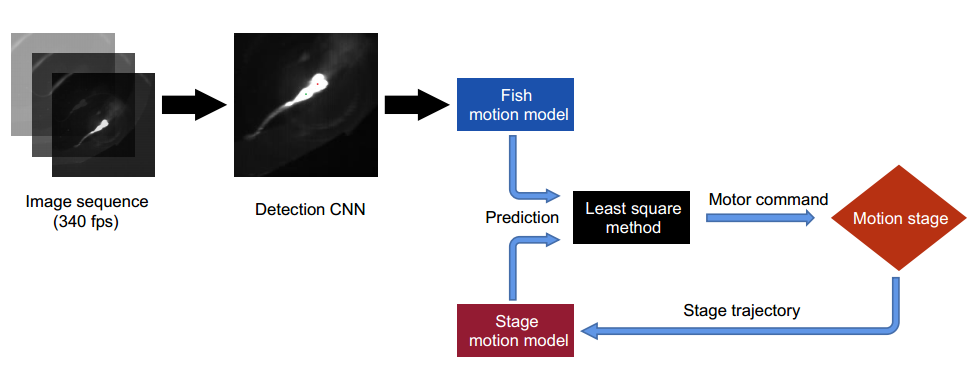

# Larval-zebrafish-tracking

The larval zebrafish tracking program for "[*All-optical interrogation of brain-wide activity in freely swimming larval zebrafish*](https://www.biorxiv.org/content/10.1101/2023.05.24.542114v1)"

## Introduction

This tracking system for larval zebrafish is a component of the whole system for whole brain imaging of neural activity in freely swimming larval zebrafish. It is built up in C++. The tracking program will detect the fish and control the motion stage to compensate the motion of fish. The tracking system can keep the fish brain complete in the field of view (FoV) of the XLFM in about 60 percent of the time when the fish is swimming. The main program is [main.cpp](Track/main.cpp). Some codes for estimation of parameters are in [setting-parameters](setting-parameters). Some codes for labelling data to train the U-Net are in [labelling-data-for-DL](labelling-data-for-DL). 

## Pipeline

 Detection of the fish 

We use a simple U-Net to detect fish head and yolk in real time. The codes for training and the trained network are in [U-net](U-net). 

 Motion stage control 

We adopted the model predictive control (MPC) method in [(1)](https://www.nature.com/articles/nmeth.4429) to control the X-Y motorized stage. We modeled the motion of the stage and the fsh, and then selected the optimal stage input by minimizing future tracking error. The main program of his part is [MPC_main.cpp](Track/MPC_main.cpp) which will call [MPC.cpp](Track/MPC.cpp).

1. Kim, D. H., Kim, J., Marques, J. C., Grama, A., Hildebrand, D. G., Gu, W., Li, J. M., and Robson, D. N. Pan-neuronal calcium imaging with cellular resolution in freely swimming zebrafsh. *Nature methods*, 14(11):1107–1114, 2017.

## Hardware

 Motorized stage 

Zolix SK25A-65SR

 Tracking camera 

A high-speed camera (0.8 ms exposure time, 340 fps, Basler aca2000-340kmNIR, Germany) to capture the lateral motion of the fish.

 Frame grabber 

BitFlow AXN-PC2-CL-1xE

 GPU 

NVIDIA GeForce RTX 3080

## Dependency

 Libraries 

TensorRT 7.2.2.3   
  
CUDA 11.1  
  
CUDNN 8.2.0  
  
OpenCV 4.55  
  
FLTK 1.4.0  
  

## Contributors
- [Daguang Li](https://github.com/Ali0Li) (`hrcs@mail.ustc.edu.cn`)
- [Kexin Qi](https://github.com/kexin2016) (`kexinqi@mail.ustc.edu.cn`)
- [Guodong Tan](https://github.com/tagodong) (`tagodong@mail.ustc.edu.cn`)
- [Quan Wen](https://github.com/wenquan) (`qwen@ustc.edu.cn`)
